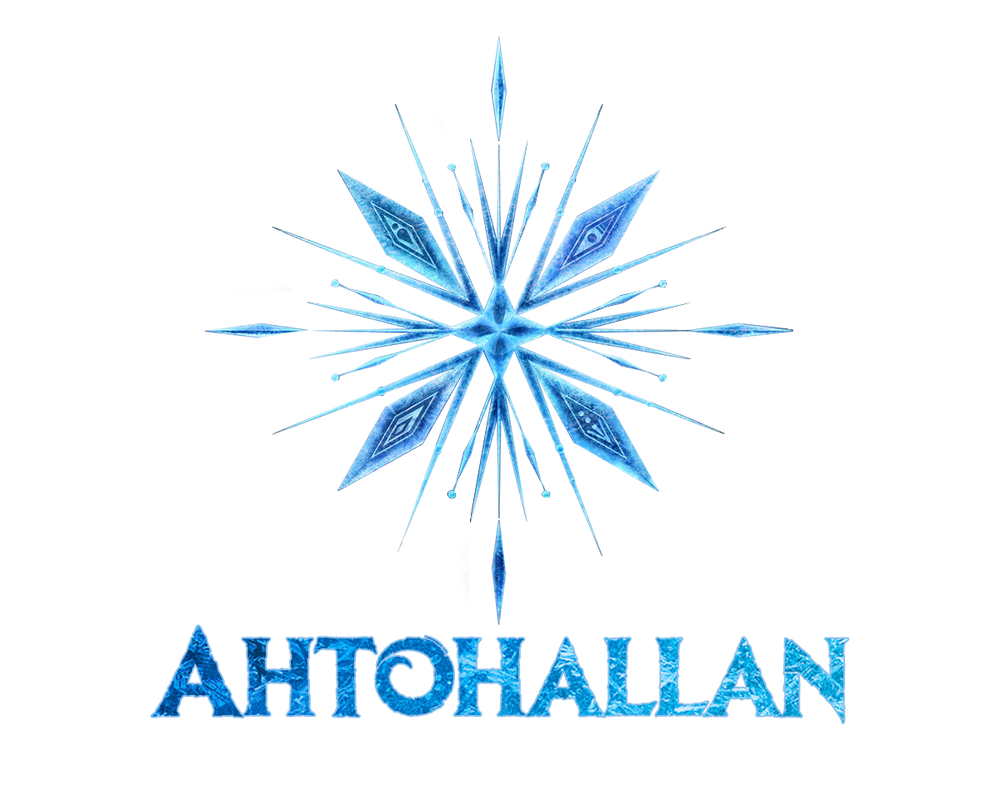

## About Ahtohallan
Hello, hello, and welcome to the show! This is Ahtohallan, a a magical language from the depths of the FCU (Frozen Cinematic Universe). Although it is inspired by our love of the FCU, one doesn't need to be a Frozen connoisseur to understand or use Ahtohallan! If you are, however, we hope you have fun seeing all the magical things water, code, and a little bit of love can offer!

Ahtohallan introduces these language features:
- An object oriented programming leanguage reminiscent of JavaScript
- Frozen casing: A style of casing where everything is capitalized, and separated by ~ Like~This ! Additionally, all keywords should be capitalized.
- Like ice, the language is strong and dynamic
- No primitive types
- Typed parameters
- Function return types
- Built-in functions
- In Ahtohallan, you can break and return from programs! You are not limited to being within a loop/switch statement, or a function. You can halt a program, or make a program return a value. How magical!
- Introducing universe appropriate error messages!

#### [View Github Repo](https://github.com/krezaey/ahtohallan)        
#### [View Grammar](https://github.com/krezaey/ahtohallan/blob/main/src/ahtohallan.ohm)

## Example Programs

### Hello World
```markdown
Sing("I wanna get this right, baby!") ❅
```

### Even Odd
```markdown
Ice Anna Square (Anna Number) {
  Arendelle Number * Number ❅
}
```

### FizzBuzz
```markdown
Ice Samantha Fizz~Buzz() {
  Let~It~Go (Meltable Anna i = 0 ❅ i <= 100 ❅ i++ ❅) {
    Get~This~Right (i % 3 == 0 && i % 5 == 0 ❅) {
      Sing("FizzBuzz") ❅
    }
    The~Next~Right~Thing (i % 3 == 0 ❅) {
      Sing("Fizz") ❅
    }
    The~Next~Right~Thing (i % 5 == 0 ❅) {
      Sing("Buzz") ❅
    }
    Into~The~Unknown {
      Sing(i) ❅
    }
  }
}
```

### Singing (Compared) Numbers
```markdown
Ice Samantha Singing~Nums(Anna x, Anna y) {
    Get~This~Right (x < y ❅) {
        Sing("The first inputted number is less than the second inputted number!") ❅
    }
    The~Next~Right~Thing (x == y ❅) {
        Sing("The first inputted number is equal to the second inputted number!") ❅
    }
    Into~The~Unknown {
        Sing("The first inputted number is neither less than or equal to the second inputted number, meaning it is greater!") ❅
    }   
}
```

### Fibonacci
```markdown
Ice Anna fibonacci(Anna num){
    Meltable Anna num1 = 0 ❅
    Meltable Anna num2 = 1 ❅
    Meltable Anna sum = 0 ❅
    Let~It~Go (Meltable Anna i = 0 ❅ i < num ❅ i++ ❅) { 
        sum = num1 + num2 ❅
        num1 = num2 ❅
        num2 = sum ❅
    }
    Arendelle num2 ❅
}  
```

## Meet the Developers
The Ahtohallan team is made up of Keziah Rezaey, Salem Tesfu, Michael Elias, Ameya Mellacheruvu,
Onariaginosa Igbinedion, & Elise Sawan. We are computer science majors at Loyola Marymount University.

**Copyright © Ahtohallan 2021**
